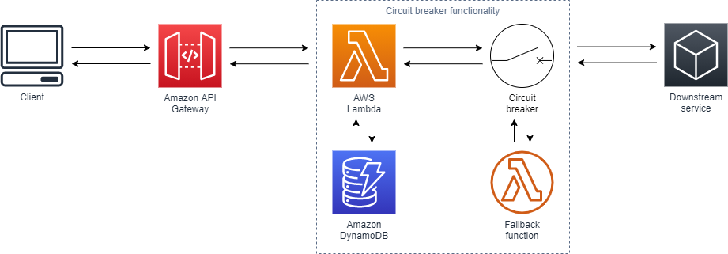

https://tech.trivago.com/2019/04/09/circuit-breaker-with-aws-step-functions/

TODOS:

[ ] Map the state machine
  [ ]  Wait before next call (call the function itself (but in a new context))
  [ ]  Establish exponential backoff rate 
        - Max Attempts: how many attempts for one function instance before it shifts back to the state machine
        - BackoffRate: exponential rate between attempts
  [ ]  Enable a DLQ(?)


State Machine States:
Current: OPEN, CLOSED, HALF
Suggested:  UNHEALTHY (OPEN), HEALTHY (CLOSED), FAILING (HALF)

From Jesse:  I'm unsure if FAILING is better than MONITORING as a state to capture moments when we've only had a small number of errors/failures or when it's itermittent.  Thoughts?


# Circuit breaker for AWS Lambda - circuitbreaker-lambda

## Description

`circuitbreaker-lambda` is a basic Node module for using the circuit breaker pattern in AWS Lambda (https://aws.amazon.com/lambda) and general async functions. It relies on a pass/fail assumption. Thresholds and timeout values are configurable and there is support for using a fallback function for graceful degradation. State and counters for the circuit breaker is stored in an Amazon DynamoDB table.



## How to install and configure

1. Install `circuitbreaker-lambda` module using NPM.
```bash
npm install circuitbreaker-lambda
```
2. Import the `circuitbreaker-lambda` module in your Lambda function code.
```js
const CircuitBreaker = require('circuitbreaker-lambda')
```
3. Add options for the circuit breaker. This is optional and if all or single options are missing the circuit breaker will revert to defaults.
```js
const options = {
  fallback: fallbackFunction,
  failureThreshold: 5,
  successThreshold: 2,
  timeout: 10000
}
```
4. Instantiate the circuit breaker with the function and optional options.
```js
const circuitBreaker = new CircuitBreaker(unreliableFunction, options)
```
5. Add the fire function for the circuit breaker.
```js
await circuitBreaker.fire()
```
6. Create an Amazon DynamoDB table with a single attribute primary key. The primary key should be a String with a value of id.
```bash
aws dynamodb create-table \
    --table-name circuitbreakerLambdaTable \
    --attribute-definitions AttributeName=id,AttributeType=S \
    --key-schema AttributeName=id,KeyType=HASH \
    --billing-mode PAY_PER_REQUEST
```
7. Give the Lambda function GetItem and UpdateItem permissions to the Lambda table.
```json
{
  "Action": [
    "dynamodb:GetItem",
    "dynamodb:UpdateItem"
  ],
  "Resource": "arn:aws:dynamodb:eu-west-1:*:table/circuitbreakerLambdaTable",
  "Effect": "Allow"
}
```
8. Add an environment variable to your Lambda function with the key CIRCUITBREAKER_TABLE and the value set to the name of your table in Amazon DynamoDB.
6. Try it out!

## Circuit breaker states

These are the different states for `circuitbreaker-lambda`.

* `CLOSED`: Everything is working normally and all calls pass through to the circuit breaker
* `OPEN`: Requests fail for a set amount of time. Fallback is used if configured.
* `HALF`: Requests are let through to test the stability of the call. Fallback is used if configured.

## State transitions

These are the ways `circuitbreaker-lambda` transitions between states.

* `CLOSED` to `OPEN`: When `failureCount` greater than or equal to `failureThreshold`.
* `OPEN` to `HALF`: When `Date.now()` greater than or equal to `nextAttempt`.
* `HALF` to `OPEN`: When failure occurs in `HALF` state.
* `HALF` to `CLOSED`: When `successCount` greater than or equal to `successThreshold`.

## Options

You can optionally add options and control the behavior of `circuitbreaker-lambda`.
```js
const options = {
  fallback: fallbackFunction,
  failureThreshold: 5,
  successThreshold: 2,
  timeout: 10000
}
```

* `fallback:` Add this option if you wish to use a fallback function in case of failure. Use the name of your function.
* `failureThreshold:` The number of failed attempts before the circuit breaker changes state to `OPEN`.
* `successThreshold` The number of successful attempts while the state is `HALF` before the circuit breaker changes state to `CLOSED`.
* `timeout` The timeout after the circuit breaker changed state to `OPEN` before it will attempt the regular function call again.

These are the default values used if options aren't defined.
```js
const defaults = {
  fallback: null,
  failureThreshold: 5,
  successThreshold: 2,
  timeout: 10000
}
```

## Example

In the subfolder `example` is a simple Serverless Framework template and an AWS SAM template which will install an example application with a Lambda function and a DynamoDB table. The example Lambda function has `circuitbreaker-lambda` installed, an example unreliableFunction which fails about 60 percent of the time (`Math.random() < 0.6`), and an example fallbackFunction.

### Serverless Framework Example
```bash
npm install
sls deploy
```

### AWS SAM Example
```bash
npm install
sam build
sam deploy --guided
```

## Notes

Inspired by Michael Nygard's book Release it! (https://www.amazon.com/gp/product/0978739213), Martin Fowler's article on the circuit breaker (https://martinfowler.com/bliki/CircuitBreaker.html), and Mark Michon's post on building a Node.js circuit breaker (https://blog.bearer.sh/build-a-circuit-breaker-in-node-js/).

## Changelog

### 2020-10-10 v0.0.1

* Initial release

## Contributors

**Gunnar Grosch** - [GitHub](https://github.com/gunnargrosch) | [Twitter](https://twitter.com/gunnargrosch) | [LinkedIn](https://www.linkedin.com/in/gunnargrosch/)
